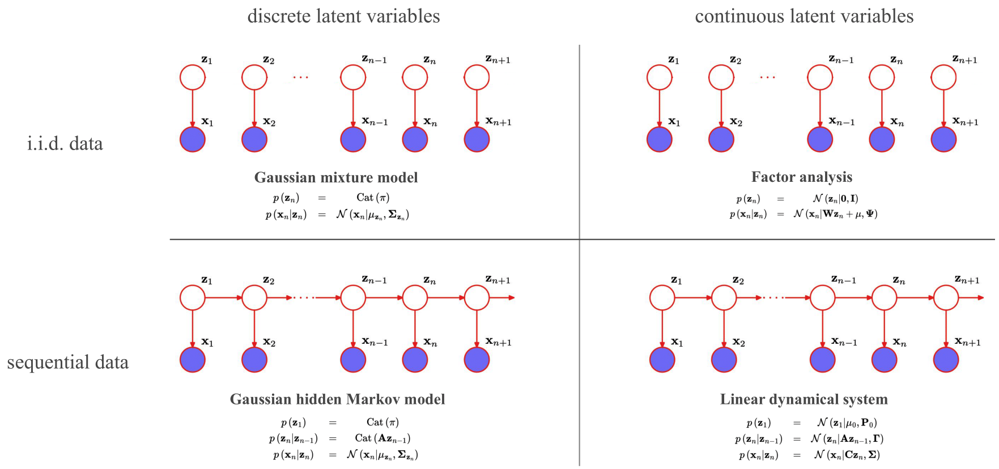

<div align="center"> 

# Simple latent variable models in Python


</div>

This repo provides **simple, easy-to-follow, from-scratch implementations** of unconditional and conditional mixture models, hidden Markov models, factor analysis, probabilistic PCA, linear dynamical systems, ICA, and particle filters. The code aims to showcase the connections between these models, and is meant to be used alongside the book "Pattern Recognition and Machine Learning" by Bishop [1], in particular chapters 9, 12, 13, and 14. We refer to the individual chapters and keep the notation consistent with the book. We also recommend reading the concise overview of Roweis & Ghahramani [2], which discusses the connections between the latent variable models explored here (figure adapted from [1]):



## Requirements

The source code uses Python >= 3.9 with `numpy` as the sole dependency. The package can be installed with:
```
pip install -e .
```

To run the notebooks, the following packages are additionally required:
```
pip install notebook
pip install scikit-learn
pip install matplotlib
```

## Disclaimer

Note that the goal of this repo is educational, so the implementations are kept as minimal/simple as possible to provide easy understanding to the reader. This means sacrificing performance and numerical stability!

## References

[1] Bishop, C. M. "Pattern Recognition and Machine Learning." New York: Springer, 2006.

[2] Roweis, Sam, and Zoubin Ghahramani. "A unifying review of linear Gaussian models." Neural computation 11.2 (1999): 305-345.
